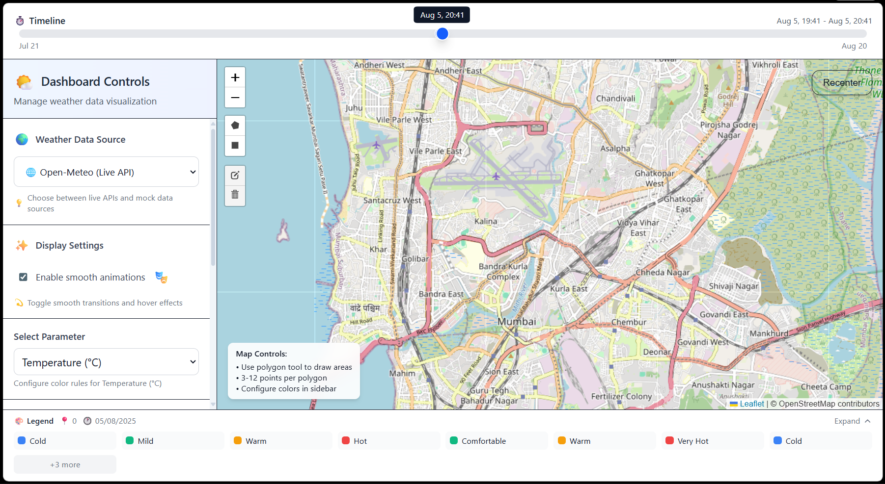
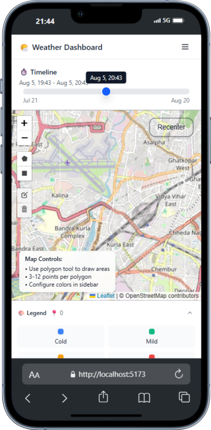

# 🌤️ Weather Dashboard

A modern, interactive weather visualization dashboard built with React, TypeScript, and Leaflet. Draw polygons on the map, configure dynamic color rules, and visualize real-time weather data with multiple data sources and advanced features.


## 🌐 Live Demo

🚀 **[View Live Demo](https://weather-dashboard-nikhilpurwar.vercel.app)** - Try it now!

[](https://vercel.com/new/clone?repository-url=https://github.com/nikhilpurwar/Weather-Dashboard)

## 📸 Screenshots

### Desktop View
The main dashboard showing the interactive map, sidebar controls, timeline slider, and compact legend.



*Features: Interactive map with polygon drawing, comprehensive sidebar with data source selection, timeline control, and responsive legend*

### Mobile Responsive Design
Optimized mobile experience with collapsible sidebar and touch-friendly controls.


*Features: Collapsible sidebar overlay, compact timeline, touch-optimized drawing tools*


## 🚀 Setup and Run Instructions

### Prerequisites

- **Node.js** 18+ (recommended 20+) - [Download](https://nodejs.org/)
- **npm** 9+ or **yarn** 1.22+ (comes with Node.js)
- Modern web browser with ES2020+ support (Chrome 90+, Firefox 88+, Safari 14+, Edge 90+)
- **Git** for cloning the repository

### Step-by-Step Setup

1. **Clone the repository**
```bash
git clone https://github.com/nikhilpurwar/Weather-Dashboard.git
cd Weather-Dashboard
```

2. **Install dependencies**
```bash
npm install
```
*This will install all required packages including React, TypeScript, Leaflet, Tailwind CSS, and development tools.*

3. **Start development server**
```bash
npm run dev
```
*The development server will start with hot reload enabled. Usually runs on `http://localhost:5173`*

4. **Open your browser**
Navigate to the URL shown in terminal (typically `http://localhost:5173`)

### Production Build

```bash
# Build optimized production bundle
npm run build

# Preview production build locally  
npm run preview

# Deploy the 'dist' folder to your hosting service
```

## 🚀 Deploy to Vercel

### Quick Deploy (Recommended)

[](https://vercel.com/new/clone?repository-url=https://github.com/nikhilpurwar/Weather-Dashboard)

### Manual Deployment Steps

1. **Install Vercel CLI**
```bash
npm install -g vercel
```

2. **Login to Vercel**
```bash
vercel login
```

3. **Deploy from project directory**
```bash
# First deployment
vercel

# Follow the prompts:
# ? Set up and deploy "~/weather-dashboard"? [Y/n] Y
# ? Which scope do you want to deploy to? [Your username]
# ? Link to existing project? [y/N] N
# ? What's your project's name? weather-dashboard
# ? In which directory is your code located? ./

# Subsequent deployments
vercel --prod
```

### Deploy via GitHub Integration

1. **Push your code to GitHub** (already done!)
2. **Visit [Vercel Dashboard](https://vercel.com/dashboard)**
3. **Click "New Project"**
4. **Import your GitHub repository**: `nikhilpurwar/Weather-Dashboard`
5. **Configure project settings**:
   - Framework Preset: `Vite`
   - Build Command: `npm run build`
   - Output Directory: `dist`
   - Install Command: `npm install`
6. **Click "Deploy"**

### Environment Variables (Optional)

If you want to customize the API or enable debug mode in production:

1. Go to your Vercel project dashboard
2. Navigate to **Settings** → **Environment Variables**
3. Add the following variables:

| Name | Value | Environment |
|------|-------|-------------|
| `VITE_WEATHER_API_BASE_URL` | `https://api.open-meteo.com/v1/forecast` | Production |
| `VITE_DEBUG` | `false` | Production |

### Post-Deployment

After successful deployment, your app will be available at:
- **Production URL**: `https://weather-dashboard-[hash].vercel.app`
- **Custom Domain**: Configure in Vercel dashboard (optional)

Your app will automatically redeploy when you push changes to the main branch!

### Development Commands

| Command | Description | Usage |
|---------|-------------|-------|
| `npm run dev` | Start development server with hot reload | Development |
| `npm run build` | Build production-ready bundle | Production |
| `npm run preview` | Preview production build locally | Testing |
| `npm run lint` | Run ESLint for code quality checks | Code Quality |

### Troubleshooting Setup

**Node.js version issues:**
```bash
# Check Node.js version
node --version  # Should be 18+

# Check npm version  
npm --version   # Should be 9+
```

**Port conflicts:**
- If port 5173 is in use, Vite will automatically try the next available port
- Check terminal output for the actual port being used

**Installation errors:**
```bash
# Clear npm cache and reinstall
npm cache clean --force
rm -rf node_modules package-lock.json
npm install
```

## 📋 Libraries and Dependencies Summary

### Core Framework & Language
| Library | Version | Purpose | Why Chosen |
|---------|---------|---------|------------|
| **React** | 19+ | UI Framework | Latest features, concurrent rendering, excellent ecosystem |
| **TypeScript** | 5+ | Type Safety | Better developer experience, catch errors at compile time |
| **Vite** | 5+ | Build Tool | Fast development server, optimized builds, excellent DX |

### Mapping & Visualization  
| Library | Version | Purpose | Why Chosen |
|---------|---------|---------|------------|
| **Leaflet** | 1.9+ | Interactive Maps | Lightweight, extensible, excellent mobile support |
| **React-Leaflet** | 4+ | React Integration | Seamless React integration for Leaflet |
| **Leaflet-Draw** | 1.0+ | Drawing Tools | Polygon drawing, editing capabilities |

### Styling & UI
| Library | Version | Purpose | Why Chosen |
|---------|---------|---------|------------|
| **Tailwind CSS** | 4+ | Utility-First CSS | Rapid prototyping, consistent design, small bundle size |
| **Lucide React** | Latest | Icons | Beautiful, consistent icons, tree-shakeable |
| **React-Range** | Latest | Range Slider | Advanced slider with dual handles for timeline |

### State & Data Management
| Library | Version | Purpose | Why Chosen |
|---------|---------|---------|------------|
| **React Context API** | Built-in | Global State | No external dependencies, perfect for app-level state |
| **dayjs** | 1.11+ | Date Manipulation | Lightweight alternative to moment.js |
| **localStorage** | Native | Data Persistence | Browser-native, simple persistence solution |

### Development Tools
| Library | Version | Purpose | Why Chosen |
|---------|---------|---------|------------|
| **ESLint** | 9+ | Code Linting | Code quality, consistency, error prevention |
| **TypeScript ESLint** | Latest | TS Linting | TypeScript-specific linting rules |
| **PostCSS** | 8+ | CSS Processing | Tailwind CSS processing, vendor prefixes |

## 🎯 Features

### ✨ Core Features

- **🗺️ Interactive Map**: Leaflet-powered mapping with pan, zoom, and reset controls
- **📐 Polygon Drawing**: Create custom areas with 3-12 points or rectangles
- **⏱️ Timeline Control**: 30-day time window with hourly precision slider
- **🎨 Dynamic Coloring**: Rule-based polygon visualization with real-time updates
- **📊 Multiple Data Sources**: Temperature, humidity, wind speed, pressure, and more
- **🌍 Live Weather Data**: Open-Meteo API integration with automatic data fetching

### 🎁 Bonus Features

- **🏷️ Polygon Labeling**: Custom naming and inline editing of polygons
- **💾 Data Persistence**: localStorage saves your settings across sessions
- **📱 Mobile Responsive**: Optimized for mobile devices and tablets
- **🔄 Multiple Data Sources**: Switch between live and mock weather data
- **🎬 Animations**: Smooth transitions and polygon color animations
- **👁️ Quick Navigation**: Click polygons in sidebar to center map view
- **📋 Compact Legend**: Collapsible legend that saves screen space
- **🎨 Enhanced UI**: Modern design with icons, gradients, and smooth animations

## 🛠️ Tech Stack Overview

**Frontend Framework**: React 19 with TypeScript 5+ for type-safe, modern development  
**Build Tool**: Vite for lightning-fast development and optimized production builds  
**Styling**: Tailwind CSS v4 for utility-first, responsive design  
**Mapping**: Leaflet with React-Leaflet for interactive maps and drawing tools  
**State Management**: React Context API with useReducer for predictable state updates  
**Icons & UI**: Lucide React icons and React-Range for enhanced user interface  
**Data**: Open-Meteo API for live weather data with localStorage persistence

### UI Components & Icons
- **Lucide React** - Beautiful, customizable icons
- **React-Range** - Advanced range slider component

## 🎨 Design & Development Remarks

### Architecture Decisions

**🏗️ Component Architecture**
- **Modular Design**: Each component has a single responsibility with clear interfaces
- **Context-Based State**: Used React Context API to avoid prop drilling while keeping state management simple
- **Custom Hooks**: Separated business logic (weather data fetching) from UI components
- **TypeScript-First**: Comprehensive type definitions ensure runtime safety and better developer experience

**📱 Responsive Design Strategy**
- **Mobile-First Approach**: Designed for mobile devices first, then enhanced for larger screens
- **Progressive Enhancement**: Core functionality works on all devices, advanced features enhance the experience
- **Touch-Optimized**: All interactive elements meet minimum 44px touch target guidelines
- **Flexible Layouts**: CSS Grid and Flexbox for adaptive layouts that work across screen sizes

**🎯 Performance Optimizations**
- **Lazy Loading**: Components load weather data only when needed to reduce initial bundle size
- **Debounced API Calls**: Prevents excessive API requests during rapid user interactions
- **Efficient Re-renders**: Context API with useReducer prevents unnecessary component re-renders
- **Bundle Splitting**: Vite automatically splits code for optimal loading performance

**🔄 State Management Philosophy**
- **Single Source of Truth**: All application state managed through AppContext
- **Immutable Updates**: State updates follow immutable patterns for predictable behavior
- **Persistence Strategy**: Critical user data (polygons, settings) persisted to localStorage
- **Action-Based Updates**: useReducer pattern for complex state transitions

### Technical Challenges & Solutions

**🗺️ Map Integration Challenges**
- **Challenge**: Integrating Leaflet (imperative) with React (declarative)
- **Solution**: Used React-Leaflet as a bridge, custom hooks for map state synchronization
- **Result**: Seamless map interactions with React component lifecycle

**📐 Polygon Drawing Complexity**
- **Challenge**: Managing polygon creation, editing, and validation
- **Solution**: Custom polygon store with validation rules (3-12 points)
- **Result**: Intuitive drawing experience with proper error handling

**🎨 Dynamic Color Visualization**
- **Challenge**: Real-time polygon coloring based on weather data and user rules
- **Solution**: Rule engine that processes color rules in order, efficient color calculation
- **Result**: Immediate visual feedback as users modify rules or data changes

**📱 Mobile Responsiveness**
- **Challenge**: Making complex map interface work on mobile devices
- **Solution**: Collapsible sidebar, touch-optimized controls, responsive legend
- **Result**: Full-featured mobile experience without compromising functionality

### Code Quality Practices

**🛡️ Type Safety**
- Comprehensive TypeScript interfaces for all data structures
- Strict mode enabled to catch potential runtime errors
- Generic types for reusable components and utilities

**🧪 Error Handling**
- Graceful API failure handling with fallback to mock data
- Input validation for user-created polygons and color rules
- Comprehensive error boundaries (recommended for production)

**♿ Accessibility Considerations**
- Semantic HTML structure for screen readers
- Keyboard navigation support for all interactive elements
- ARIA labels for complex UI components like map controls
- Sufficient color contrast ratios for visual elements

**🔧 Development Experience**
- Hot reload for instant feedback during development
- ESLint configuration for consistent code style
- Clear component organization with index files for clean imports
- Comprehensive TypeScript types for excellent IDE support

### API Integration Strategy

**🌍 Weather Data Handling**
- **Open-Meteo API**: Free, reliable weather service with global coverage
- **Caching Strategy**: Client-side caching with TTL to reduce API calls
- **Fallback System**: Mock data generation when API is unavailable
- **Error Recovery**: Automatic retry logic with exponential backoff

### Future Scalability Considerations

**📊 Data Management**
- Current localStorage approach suitable for single-user applications
- Architecture supports easy migration to external databases
- State management pattern scales well for additional features

**🚀 Performance Scaling**
- Component lazy loading ready for code splitting
- Memoization strategies in place for expensive calculations
- Bundle size monitoring and optimization strategies implemented

## 🎮 How to Use

### 1. Drawing Polygons
1. Click the **polygon tool** 📐 on the map
2. Click to place vertices (3-12 points maximum)
3. Double-click to complete the polygon
4. Use **rectangle tool** for quick rectangular areas

### 2. Timeline Control
1. Use the **dual slider** at the top to select time range
2. Drag handles to adjust start/end times
3. See real-time feedback of selected dates and times

### 3. Data Sources & Color Rules
1. Select a **data source** in the sidebar (Temperature, Humidity, etc.)
2. Add **color rules** with operators (`<`, `<=`, `=`, `>=`, `>`) and values
3. Use color picker or predefined colors
4. Rules are applied in order - first match determines polygon color

### 4. Polygon Management
1. **Rename**: Click the edit ✏️ icon next to any polygon
2. **View**: Click the eye 👁️ icon to center map on polygon
3. **Delete**: Click the trash 🗑️ icon to remove polygon
4. **Toggle Animations**: Enable/disable smooth color transitions

### 5. Legend & Status
1. View **compact legend** at the bottom showing color rules
2. **Expand/collapse** legend for detailed information
3. See polygon count and selected time range
4. Current data source and status information

## 📊 Data Sources

| Source | Description | Unit | API Parameter |
|--------|-------------|------|---------------|
| **Temperature** | Air temperature at 2m height | °C | `temperature_2m` |
| **Humidity** | Relative humidity | % | `relative_humidity_2m` |
| **Wind Speed** | Wind speed at 10m height | m/s | `wind_speed_10m` |
| **Precipitation** | Total precipitation | mm | `precipitation` |
| **Mock Data** | Simulated weather patterns | Various | Local generation |

## 🏗️ Project Structure

```
src/
├── components/
│   ├── MapView/            # Leaflet map with drawing tools
│   ├── TimelineSlider/     # Time range selection component
│   ├── Sidebar/            # Controls and configuration panel
│   ├── Legend/             # Compact, responsive color legend
│   ├── PolygonTools/       # Drawing tools and polygon management
│   └── ColorRuleEditor/    # Dynamic color rule configuration
├── context/
│   └── AppContext.tsx      # Global state management with persistence
├── hooks/
│   └── useWeatherData.ts   # Weather API integration and caching
├── api/
│   └── weatherApi.ts       # Open-Meteo API client
├── types/
│   └── index.ts           # TypeScript interfaces and types
└── utils/                 # Utility functions and helpers
```

## ⚙️ Configuration

### Environment Variables

Create `.env.local` for custom configuration:

```env
# Optional: Custom API base URL
VITE_WEATHER_API_BASE_URL=https://api.open-meteo.com/v1/forecast

# Optional: Enable debug mode
VITE_DEBUG=true
```

### Customization

#### Adding New Data Sources
1. Update `dataSources` array in `AppContext.tsx`
2. Add API mapping in `weatherApi.ts`
3. Extend `WeatherDataPoint` interface in `types/index.ts`

#### Custom Map Tiles
```tsx
// In MapView.tsx, replace TileLayer URL
<TileLayer
  url="https://{s}.tile.openstreetmap.org/{z}/{x}/{y}.png"
  attribution="© OpenStreetMap contributors"
/>
```

#### Color Themes
Modify Tailwind CSS classes in components or update `tailwind.config.js`

## 🔧 Development

### Code Quality
- **ESLint** - Configured with React and TypeScript rules
- **TypeScript** - Strict mode enabled for type safety
- **Prettier** - Code formatting (configure in your editor)

### Performance Features
- **Debounced API calls** - Prevents excessive requests
- **Efficient re-rendering** - Context-based state management  
- **Lazy loading** - Components load data only when needed
- **Error boundaries** - Graceful fallbacks for API failures
- **Responsive design** - Mobile-first approach

### Browser Support
- **Chrome** 90+
- **Firefox** 88+
- **Safari** 14+
- **Edge** 90+

## 🐛 Troubleshooting

### Common Issues

**Map not loading:**
- Check internet connection
- Verify Leaflet CSS imports in `main.tsx`
- Clear browser cache and localStorage

**Weather data not updating:**
- Check browser console for API errors
- Verify polygon coordinates are valid (latitude: -90 to 90, longitude: -180 to 180)
- Check Open-Meteo API status

**Drawing tools not working:**
- Ensure map container has proper height/width
- Check for JavaScript errors in console
- Verify Leaflet and React-Leaflet versions

**Performance issues:**
- Limit number of polygons (recommended: < 50)
- Use shorter time ranges for better performance
- Check browser memory usage

## 📱 Mobile Support

The dashboard is fully responsive and mobile-optimized:
- **Touch-friendly** drawing tools
- **Collapsible sidebar** with overlay on mobile
- **Compact timeline** slider for small screens
- **Optimized legend** that saves screen space
- **Touch gestures** for map navigation

## 🔮 Future Enhancements

- **Advanced Polygon Editing**: Vertex manipulation and reshaping
- **Data Export**: CSV/JSON export of weather data
- **Offline Support**: Service worker for offline functionality
- **Custom Map Layers**: Satellite imagery, weather overlays
- **Time-lapse Animation**: Visualize weather changes over time
- **Multi-user Collaboration**: Share and collaborate on maps
- **Advanced Analytics**: Weather trend analysis and forecasting

## 📄 License

This project is licensed under the MIT License - see the [LICENSE](LICENSE) file for details.

## 🤝 Contributing

1. Fork the repository
2. Create your feature branch (`git checkout -b feature/AmazingFeature`)
3. Commit your changes (`git commit -m 'Add some AmazingFeature'`)
4. Push to the branch (`git push origin feature/AmazingFeature`)
5. Open a Pull Request

## 📞 Support

If you encounter any issues or have questions:

1. Check the [Issues](https://github.com/nikhilpurwar/Weather-Dashboard/issues) page
2. Create a new issue with detailed description
3. Provide browser version and steps to reproduce

## 🌟 Acknowledgments

- [Open-Meteo](https://open-meteo.com/) for free weather API
- [Leaflet](https://leafletjs.com/) for mapping functionality
- [React-Leaflet](https://react-leaflet.js.org/) for React integration
- [Tailwind CSS](https://tailwindcss.com/) for styling framework
- [Lucide](https://lucide.dev/) for beautiful icons

---

**Built with ❤️ by [Nikhil Purwar](https://github.com/nikhilpurwar)**

Made with React 19, TypeScript, and modern web technologies.
